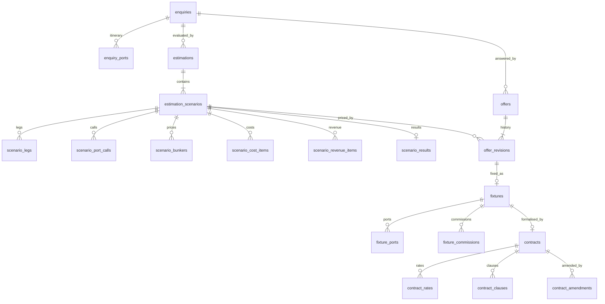
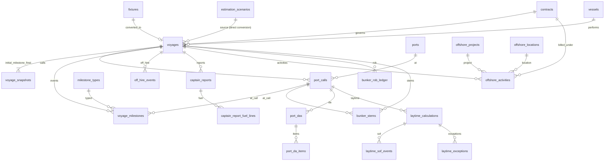
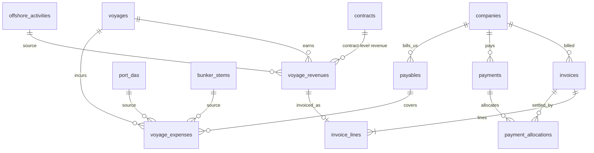
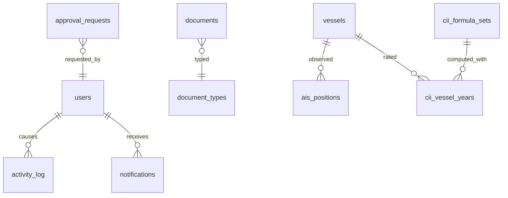

# 04 — Database ERD

Status: DRAFT v0.1. Logical model; column detail in 05. MySQL 8 / InnoDB / utf8mb4. All tables have `id` bigint PK, `created_at`, `updated_at`; business tables add `created_by`, `updated_by` (FK users, nullOnDelete) and `deleted_at` where marked (SD).

## 1. Master data

```mermaid
erDiagram
    vessel_types ||--o{ vessels : classifies
    vessel_types ||--o{ vessel_type_attributes : defines
    vessels ||--o{ vessel_attribute_values : has
    vessel_type_attributes ||--o{ vessel_attribute_values : typed_by
    vessels ||--o{ vessel_consumption_profiles : versions
    vessel_consumption_profiles ||--o{ vessel_consumption_rates : rates
    fuel_types ||--o{ vessel_consumption_rates : fuel
    vessels ||--o{ vessel_status_history : status
    companies ||--o{ vessels : "owner/manager (FKs)"
    companies ||--o{ company_roles : plays
    companies ||--o{ company_aliases : known_as
    companies ||--o{ contacts : employs
    companies ||--o{ company_bank_accounts : banks
    ports ||--o{ port_agents : served_by
    companies ||--o{ port_agents : agent
    ports ||--o{ port_distances : from
    ports ||--o{ port_distances : to
    currencies ||--o{ exchange_rates : quoted
```

## 2. Commercial chain



## 3. Operations



## 4. Finance



## 5. Cross-cutting



`documents` and `approval_requests` are polymorphic (`documentable_type/id`, `approvable_type/id`) using a morph map (short aliases, not class names).

## 6. Reference vs snapshot (Snapshot Principle)

| Data | Referenced (FK) | Snapshotted (copied value) at |
|---|---|---|
| Vessel identity | `vessel_id` everywhere | Name/IMO/DWT copied into fixture & contract recap and invoice header |
| Speed / consumption | profile id for traceability | Scenario stores speed and per-fuel consumption values; voyage `initial` snapshot |
| Fuel prices | — | Scenario bunkers; bunker stems (actual price) |
| Port costs | port_id | Scenario port costs; DA actuals |
| Distances | cache row id + provider | Scenario legs store `distance_nm`, `eca_distance_nm`, provider, calculated_at |
| Rates & commissions | — | Offer revision → fixture → contract rates (each its own copy); invoice lines |
| Exchange rates | rate row id (nullable) | Every monetary row stores `fx_rate`, `base_amount` |
| Counterparties | `company_id` | Invoice stores billing name/address/tax no. at issue |
| Commercial terms | — | Fixture terms, contract clauses (versioned via amendments) |

## 7. Uniqueness and integrity constraints (key ones)

- `vessels.imo_number` unique (nullable for non-IMO craft), `vessels.mmsi` unique nullable.
- `ports.unlocode` unique nullable.
- `estimation_scenarios (estimation_id, code)` unique; at most one `is_selected=1` per estimation (enforced in service with lock; MySQL lacks partial index — use generated column `selected_key = IF(is_selected, estimation_id, NULL)` unique).
- `offer_revisions (offer_id, revision_no)` unique.
- `fixtures.offer_revision_id` unique; `fixtures.fixture_number` unique.
- `contracts.contract_number` unique; `contract_amendments (contract_id, amendment_no)` unique.
- `voyages.voyage_number` unique; `voyages.fixture_id` unique nullable.
- `voyage_snapshots (voyage_id, type)` unique for `initial` and `final` (generated-column technique).
- `invoices.invoice_number` unique; `invoice_lines.voyage_revenue_id` unique nullable (no double-invoicing of a revenue line — BR-INV-02).
- `payment_allocations (payment_id, invoice_id)` unique.
- `exchange_rates (rate_date, base_currency, quote_currency, source)` unique.
- `ais_positions (vessel_id, observed_at, provider)` unique.
- `bunker_rob_ledger (voyage_id, fuel_type_id, period_start)` unique.
