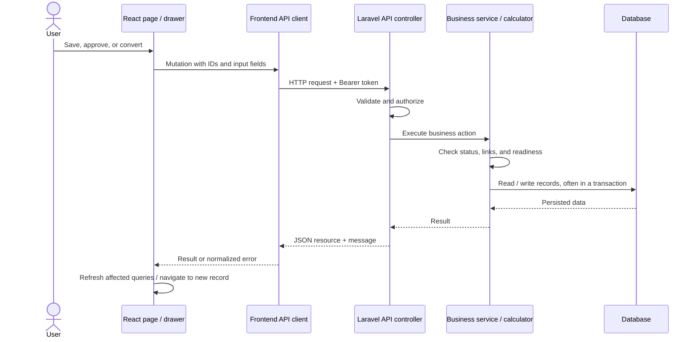
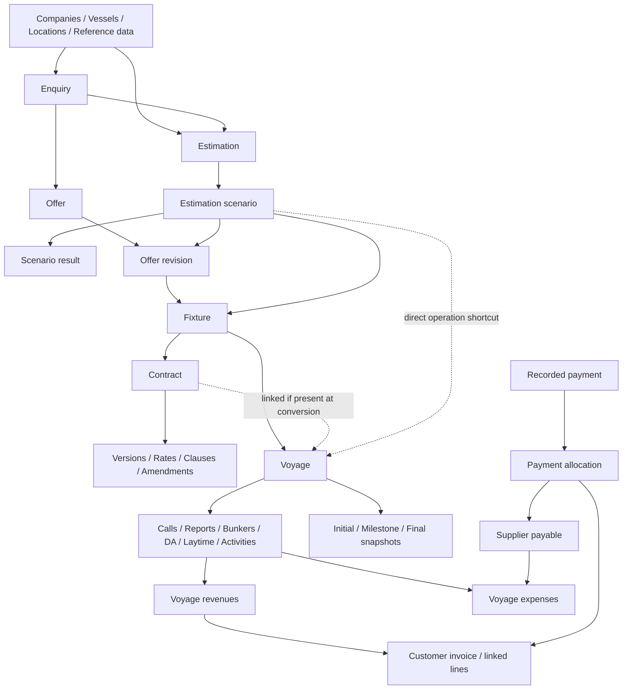

# Data Flow Reference: Relationships, Handoffs, and API Examples

**Verified against the implementation:** 2026-10-05

**Audience:** Developers, API testers, and administrators investigating record links

Read the [End-to-End Data Flow Guide](DATA-FLOW-GUIDE.md) for the screen-by-screen business process. This document maps that process to stored data and backend actions.

## Contents

1. [Browser-to-database request flow](#1-browser-to-database-request-flow)
2. [Business record relationships](#2-business-record-relationships)
3. [Conversion and snapshot rules](#3-conversion-and-snapshot-rules)
4. [Main workflow API actions](#4-main-workflow-api-actions)
5. [Linked-finance example](#5-linked-finance-example)
6. [Operations-to-finance automation](#6-operations-to-finance-automation)
7. [Source-code map](#7-source-code-map)
8. [Seeding behavior](#8-seeding-behavior)

## 1. Browser-to-database request flow



- Sidebar destinations are in [`navigation.ts`](../frontend/src/config/navigation.ts).
- The Axios client in [`client.ts`](../frontend/src/api/client.ts) uses the configured API URL and attaches a Bearer token.
- Routes are under `/api/v1` in [`api.php`](../backend/routes/api.php).
- Controllers validate requests and delegate the business logic. Many read actions use repositories; transitions/conversions use services.
- Services enforce record state, allowed relationships, calculation readiness, and approval rules. Relevant actions also write activity/audit records.
- JSON resources format the stored records for the frontend. React Query mutations refresh affected lists/details or navigate to the newly created record.

The app does not advance because you view a page. Advancement happens when an explicit action is submitted or a documented automation runs.

## 2. Business record relationships



Arrows show dependencies/handoffs. See sections 3 and 6 for the actions that actually create records.

| Table / model | Important links and contents |
|---|---|
| `enquiries` | Customer/charterer, broker, business type, dates, quantity/period, rate idea |
| `enquiry_ports` | `enquiry_id`, sequence, either `port_id` or `offshore_location_id`, purpose |
| `enquiry_vessels` | `enquiry_id`, `vessel_id`, shortlist state |
| `estimations` | `enquiry_id` (optional), `vessel_id`, estimation type, currency, approval state |
| `estimation_scenarios` | `estimation_id`, code, selected flag, vessel snapshot, `inputs`, calculation state/hash/version |
| `scenario_results` | `scenario_id`; one persisted result per scenario, including breakdown/trace |
| `offers` | `enquiry_id`, `vessel_id`, counterparty, overall offer state |
| `offer_revisions` | `offer_id`, revision number, `estimation_scenario_id`, direction, negotiated commercial fields |
| `fixtures` | `offer_revision_id`, `estimation_scenario_id`, `enquiry_id`, `vessel_id`, frozen commercial recap |
| `contracts` | Optional `fixture_id`, customer, vessel, dates, currency, current version |
| `contract_versions`, `contract_rates`, `contract_clauses`, `contract_amendments` | Contract version/effective-date history and terms |
| `voyages` | `fixture_id`, `contract_id`, `estimation_id`, `estimation_scenario_id`, vessel, customer, conversion/operation type |
| `voyage_snapshots` | `voyage_id`, type (`initial`, `milestone`, `final`), preserved payload |
| `port_calls` | `voyage_id`, ordered route point, agent, estimated/actual timestamps |
| `captain_reports`, `bunker_stems` | Vessel/voyage links, report or delivery actuals; reports have fuel-line children |
| `port_das`, `laytime_calculations` | Voyage/call links and cost/time calculations |
| `offshore_activities` | Vessel, voyage/project/contract/location links, hours, effective-rate snapshot |
| `voyage_revenues` | Voyage/contract links, optional activity/laytime links, category, amounts, commissions, FX |
| `voyage_expenses` | Voyage/contract links, supplier, category, amounts/FX, optional polymorphic source |
| `invoices`, `invoice_lines` | Customer, optional voyage/contract, billing snapshot, lines; optional `voyage_revenue_id` on each line |
| `payables` | Supplier, optional `voyage_id`, supplier invoice reference, totals and paid balance |
| `payments`, `payment_allocations` | Payment company/direction/amount; allocation links to exactly one invoice or payable |

Lookup/master records normally use relational IDs. Commercial and calculation history also stores JSON snapshots, so historical values can be preserved even when masters change.

## 3. Conversion and snapshot rules

| Handoff | Reads | Writes | Important condition |
|---|---|---|---|
| Enquiry → Estimation | Enquiry, active vessel, effective consumption profile, stored distances | Estimation + default scenario, attempted calculation | Enquiry must accept new work |
| Scenario edit → Results | Saved inputs, estimation type/currency | Scenario result and calculation hash/version/status | Invalid/incomplete input produces issues instead of a valid result |
| Estimation → Offer | Enquiry terms, scenario primary revenue item | Offer + Draft revision 1 | UI offers this for approved, enquiry-linked estimations; backend validates scenario belongs to the same enquiry/vessel |
| Accepted revision → Fixture | Accepted terms, selected scenario, vessel/parties | Fixture + recap snapshot; enquiry Fixed | Selected scenario must belong to an approved estimation |
| Approved fixture → Contract | Parties, dates, rate/basis, commissions/terms | Draft contract + rate rows | Start copied from laycan; end date initially empty |
| Contract approval | Draft header, rates, clauses | Approved version 1 | Both dates and at least one rate required for submission |
| Approved fixture → Voyage | Fixture, scenario result, existing non-cancelled contract | Draft voyage + Initial snapshot | One voyage per fixture; operational calls not generated |
| Approved estimation → Direct voyage | Selected scenario and current result | Draft voyage + Initial snapshot + reason | No fixture may already exist for the scenario |
| Voyage finalization | Current operational metrics and readiness gates | Final snapshot + Finalized state | Completed voyage, no Draft off-hire; gates passed or explicitly waived |

Fixture, contract, and voyage conversions return an existing converted record on a repeated request instead of creating another copy for the same source.

### Snapshot boundaries

- `ScenarioDefaults` captures master values at creation or explicit refresh. Recalculation uses stored scenario assumptions; currency decimal precision is obtained from the currency catalogue.
- Saving changed scenario inputs attempts recalculation and maintains a hash used by selection/submission readiness checks.
- Sent/received offer revisions are frozen; negotiations create new revisions.
- Fixture commercial fields are copied from the accepted revision and remain locked.
- Approved contract versions are preserved; approved amendments create effective-dated versions.
- Voyage conversion preserves an Initial snapshot. Later operational snapshots do not change that original baseline.
- Invoice creation captures customer billing details; issue captures FX and assigns the invoice number.

**Estimate, actual profit, billing, and cash are separate data layers.** A conversion does not turn scenario revenue/cost items into actual voyage ledger entries. Invoice lines do not become voyage revenue entries merely because their descriptions match.

## 4. Main workflow API actions

All paths below are relative to `/api/v1` and require the appropriate authenticated-user permissions. `{id}` placeholders refer to the actual record IDs returned by the API.

| Stage | Request |
|---|---|
| Create enquiry | `POST /enquiries` |
| Shortlist vessel | `POST /enquiries/{enquiry}/vessels` |
| Create estimation | `POST /estimations` |
| Read/save scenario | `GET` / `PUT /estimations/{estimation}/scenarios/{scenario}` |
| Calculate/select scenario | `POST /estimations/{estimation}/scenarios/{scenario}/calculate` / `select` |
| Add scenario / refresh defaults | `POST /estimations/{estimation}/scenarios` / `POST /estimations/{estimation}/scenarios/{scenario}/refresh-defaults` |
| Estimation approval | `POST /estimations/{estimation}/submit`, `/approve`, `/reject`, `/reopen` |
| Create offer from context | `POST /offers` with `enquiry_id`, `vessel_id`, `estimation_scenario_id` |
| Draft offer revision | `POST /offers/{offer}/revisions` or `PUT /offers/{offer}/revisions/{revision}` |
| Release/decide revision | `POST /offers/{offer}/revisions/{revision}/send`, `/receive`, `/accept`, `/reject` |
| Create fixture | `POST /offers/{offer}/revisions/{revision}/convert-to-fixture` |
| Fixture workflow | `POST /fixtures/{fixture}/submit`, `/approve`, `/reject`, `/fail`, `/cancel` |
| Create contract/voyage from fixture | `POST /fixtures/{fixture}/convert-to-contract` / `/convert-to-voyage` |
| Contract workflow | `POST /contracts/{contract}/submit`, `/approve`, `/activate`, `/complete` |
| Generate estimation PDF | `POST /estimations/{estimation}/scenarios/{scenario}/pdf` |
| Generate offer revision PDF | `POST /offers/{offer}/revisions/{revision}/pdf` |
| Generate fixture recap / contract PDF | `POST /fixtures/{fixture}/pdf` / `POST /contracts/{contract}/pdf` |
| Download generated document | `GET /documents/{document}/download` |
| Direct voyage | `POST /estimations/{estimation}/convert-to-voyage` |
| Add/edit call | `POST /voyages/{voyage}/port-calls` / `PUT /voyages/{voyage}/port-calls/{portCall}` |
| Voyage status and closure | `POST /voyages/{voyage}/transition`, `/complete`, `/finalize`, `/reopen`, `/cancel` |
| Read readiness / ROB | `GET /voyages/{voyage}/finance-gates` / `/rob-ledger` |
| Actual revenue/expense | `POST /voyage-revenues` / `/voyage-expenses` |
| Confirm/approve actuals | `POST /voyage-revenues/{revenue}/confirm`; `POST /voyage-expenses/{expense}/confirm` / `approve` |
| Create invoice / attach revenue | `POST /invoices`; `POST /invoices/{invoice}/revenue-lines` |
| Invoice approval/issue | `POST /invoices/{invoice}/submit`, `/approve`, `/issue` |
| Create/approve payable | `POST /payables`; `POST /payables/{payable}/approve` |
| Record/allocate payment | `POST /payments`; `POST /payments/{payment}/allocate` |
| Voyage actual P&L | `GET /voyages/{voyage}/financials` |
| Aging / balancing | `GET /receivables/aging`; `GET /balancing/accounts`; `GET /balancing/cash-flow` |

Many update requests require the current `lock_version`, obtained from the last read. On a stale-record error, reload before applying edits.

PDF generation returns a `201` document envelope and stores a private, immutable file snapshot in the existing document register. Generation requires `documents.view`, `documents.upload`, and the parent's view/update permissions. Contract PDF generation and download additionally require `contracts.rates.view`. PDFs use company identity from Settings; their filenames identify the scenario, offer revision, fixture, or current contract version. Generation does not send email or change workflow status. Implementation: `CommercialPdfController`, `CommercialPdfService`, `DocumentService::storeGeneratedPdf`, and `resources/views/commercial/document-pdf.blade.php`.

## 5. Linked-finance example

The current manual revenue, expense, invoice, and payable creation drawers omit some relationship fields. These API examples complete the linked handoff for testing.

Use Postman or another authenticated API client with `Accept: application/json`, `Content-Type: application/json`, and the session's Bearer token. Values such as `{{voyage_id}}` are Postman-style variables; substitute actual numeric IDs. Amounts are decimal strings. Choose real issue/due dates appropriate to your exercise.

Find the seeded voyage/customer/contract by their demo numbers, or use the new records created in your exercise. Find the FREIGHT category via `GET /reference/revenue-categories`. Do not assume IDs are the same across databases.

### 5.1 Create actual freight revenue

`POST /api/v1/voyage-revenues`

```json
{
  "voyage_id": {{voyage_id}},
  "contract_id": {{contract_id}},
  "revenue_category_id": {{freight_category_id}},
  "description": "Actual voyage freight",
  "is_estimate": false,
  "amount": "300000.00",
  "currency": "USD",
  "commission_pct_total": "3.75"
}
```

Save the returned revenue ID. Then call `POST /api/v1/voyage-revenues/{revenue_id}/confirm`. It now contributes to actual voyage P&L.

### 5.2 Create an invoice attached to that revenue

`POST /api/v1/invoices`

```json
{
  "invoice_type": "freight",
  "customer_company_id": {{customer_company_id}},
  "voyage_id": {{voyage_id}},
  "contract_id": {{contract_id}},
  "issue_date": "2026-10-05",
  "due_date": "2026-11-04",
  "currency": "USD",
  "revenue_ids": [{{revenue_id}}]
}
```

This creates the draft invoice and its linked line, marks the revenue Invoiced, and reserves it against double billing. Revenue and invoice currencies must match.

For an existing editable invoice, use `POST /api/v1/invoices/{invoice_id}/revenue-lines` with `{"revenue_ids": [{{revenue_id}}]}` instead.

Submit/approve as appropriate and call `POST /api/v1/invoices/{invoice_id}/issue`. The invoice number is assigned on issue. This can also be done through the invoice detail page once the linked record exists.

### 5.3 Record and allocate the customer receipt

`POST /api/v1/payments`

```json
{
  "direction": "received",
  "company_id": {{customer_company_id}},
  "payment_date": "2026-10-05",
  "amount": "300000.00",
  "currency": "USD",
  "method": "wire",
  "bank_reference": "FLOW-EXERCISE-RECEIPT-001"
}
```

Then `POST /api/v1/payments/{payment_id}/allocate`:

```json
{
  "allocations": [
    {"invoice_id": {{invoice_id}}, "amount": "300000.00"}
  ]
}
```

For this untaxed, USD example, the invoice becomes Paid with zero balance. If tax or another charge was added, allocate the actual outstanding total instead. The payment's unallocated amount decreases; its status remains Recorded.

### 5.4 Book and settle a supplier cost

`POST /api/v1/payables`

```json
{
  "supplier_company_id": {{supplier_company_id}},
  "supplier_invoice_ref": "FLOW-EXERCISE-FUEL-001",
  "voyage_id": {{voyage_id}},
  "issue_date": "2026-10-05",
  "due_date": "2026-11-04",
  "currency": "USD",
  "subtotal": "150000.00",
  "tax": "0.00"
}
```

Call `POST /api/v1/payables/{payable_id}/approve` using the appropriate approver. The voyage-linked payable creates an Approved expense sourced from that payable. Review its category: payable approval uses a default/fallback expense category, not a fuel-category picker.

Record a payment with `direction: "paid"` and the same supplier, then allocate using `{"allocations": [{"payable_id": {{payable_id}}, "amount": "150000.00"}]}`.

The payable becomes Paid. Its linked expense remains Approved in the current implementation; payment allocation does not call the expense `markPaid` method.

### 5.5 Review what changed

- `GET /voyages/{voyage_id}/financials`: actual revenue, commissions, costs, profit, category breakdown, and any available estimate baseline.
- `GET /voyage-revenues?voyage_id={voyage_id}` and `/voyage-expenses?voyage_id={voyage_id}`: source ledger rows.
- `GET /invoices/{invoice_id}` and `/payables/{payable_id}`: paid amounts and balances.
- `GET /payments/{payment_id}`: allocation targets and unallocated cash.

With only the above example lines, actual net profit is `300,000 − 150,000 − 11,250 = USD 138,750`. This is an illustration of the ledger calculation, not a seeded or complete voyage profit figure.

The seeded voyage has no Initial snapshot, so it can show actuals after these linked entries while estimated figures remain unavailable.

## 6. Operations-to-finance automation

| Source action | Record produced | Source link / details |
|---|---|---|
| Verify offshore activity with positive priced revenue | Confirmed voyage revenue | `offshore_activity_id`; contract-derived rate and activity period |
| Agree laytime with positive demurrage | Confirmed voyage revenue | `laytime_calculation_id` |
| Agree laytime with positive despatch | Confirmed voyage expense | Polymorphic laytime source; payee left unset |
| Approve final Port DA | Confirmed voyage expenses for nonzero actual items | Polymorphic DA source; DA cost category must map to an expense category |
| Approve voyage-linked payable | Approved voyage expense | Polymorphic payable source; full payable total including tax |
| Deliver bunker stem | Delivery quantities, amount, and FX on the stem | ROB reconciliation reads delivered stems; this action does not book an expense/payable |
| Verify captain report | Operational metrics / ROB input | Report fuel lines; optional explicit arrival/departure time copy |

Current boundaries relevant to tracing:

- Generic freight/hire actuals are entered explicitly; fixture/voyage creation does not generate them.
- The invoiced status is set on revenue when attached to an invoice. The invoice service does not also advance the related offshore activity to Invoiced.
- Payable payment allocation updates the payable, not its sourced expense status.
- There is no automatic cost matching across Port DA, manual expense, bunker order, and payable records. Those source links identify origin but do not deduplicate the same business cost across different origins.
- Actual P&L includes non-estimate revenues in Confirmed/Invoiced and expenses in Confirmed/Approved/Paid. Draft/Cancelled and unlinked rows do not feed the voyage's actual P&L.
- Finalization readiness checks confirmed revenue, existing final DAs, existing laytime calculations, and ROB flags; a passing check is not proof that missing records were entered. Customer/supplier settlement is separate from finalization.

## 7. Source-code map

Paths below are relative to the project root.

| Responsibility | Main files |
|---|---|
| Demo setup | `backend/database/seeders/DatabaseSeeder.php`, `InitialDemoDataSeeder.php` |
| Enquiry progression | `backend/app/Services/Chartering/EnquiryWorkflow.php` |
| Estimation creation/approval | `backend/app/Services/Chartering/EstimationService.php` |
| Scenario defaults, edits, calculations | `backend/app/Services/Chartering/ScenarioDefaults.php`, `ScenarioService.php`, `ScenarioCalculationService.php` |
| Calculation input / engine | `backend/app/Domain/Estimation/Input/ScenarioInput.php`, `ConsumptionInput.php`, `backend/app/Domain/Estimation/EstimationCalculator.php` |
| Offer negotiation | `backend/app/Services/Chartering/OfferService.php` |
| Fixture snapshot / lifecycle | `backend/app/Services/Chartering/FixtureService.php`, `FixtureWorkflowService.php` |
| Fixture conversions | `backend/app/Services/Contracts/FixtureConversionService.php` |
| Direct estimation conversion | `backend/app/Services/Chartering/VoyageConversionService.php` |
| Contract versions/amendments | `backend/app/Services/Contracts/ContractService.php`, `ContractAmendmentService.php`, `ContractRateResolver.php` |
| Voyage states/completion/finalization | `backend/app/Models/Voyage.php`, `backend/app/Services/Operations/VoyageLifecycleService.php` |
| Call timing, reports, fuel ledger | `backend/app/Services/Operations/PortCallService.php`, `CaptainReportService.php`, `RobLedgerService.php`, `BunkerStemService.php` |
| Operational financial sources | `backend/app/Services/Operations/PortDaService.php`, `LaytimeService.php`, `OffshoreActivityService.php` |
| Actual ledger / P&L | `backend/app/Services/Finance/VoyageRevenueService.php`, `VoyageExpenseService.php`, `VoyageFinancialService.php` |
| Billing / settlement | `backend/app/Services/Finance/InvoiceService.php`, `PayableService.php`, `PaymentService.php` |
| Approval settings | `backend/app/Services/Chartering/ApprovalGuard.php`, `backend/config/offshore.php`; Port DA checks configuration directly |
| Chartering UI handoffs | `frontend/src/pages/chartering/EnquiryDetailPage.tsx`, `EstimationDetailPage.tsx`, `OfferDetailPage.tsx`, `FixtureDetailPage.tsx` |
| Voyage UI | `frontend/src/pages/operations/VoyageDetailPage.tsx` and its panels/tables |
| Finance UI coverage | `frontend/src/pages/commercial/LedgerPage.tsx`, `InvoicesPage.tsx`, `InvoiceDetailPage.tsx`, `PayablesPage.tsx`, `PaymentDetailPage.tsx` |
| Frontend API calls | `frontend/src/api/chartering.ts`, `contracts.ts`, `operations.ts`, `finance.ts` |

For complete schemas and API coverage, also see [Database ERD](04-DATABASE-ERD.md), [Database Dictionary](05-DATABASE-DICTIONARY.md), and [API Specification](06-API-SPECIFICATION.md). The source files above are the reference for the exact current transition behavior.

## 8. Seeding behavior

`DatabaseSeeder` runs these seeders in order:

```text
RolesAndPermissionsSeeder
    → DocumentTypeSeeder
    → ReferenceDataSeeder
    → AdminUserSeeder
    → InitialDemoDataSeeder
```

Inside `InitialDemoDataSeeder`, a transaction creates/looks up:

```text
Companies + Contacts + Company Roles
    → Ports + Offshore Locations + Port Agents
    → Vessels + Consumption Profiles/Rates + Status History
    → Stored Distances
    → Enquiry + Enquiry Itinerary + Shortlist
    → Estimation + Scenario
    → Offer + Revision
    → Fixture
    → Contract + Version + Rate + Clause
    → Voyage + Three Port Calls
```

These writes use model queries directly, not the normal workflow/conversion services. Statuses are supplied by the seed. This explains the demo's Submitted/not-calculated estimation, Accepted offer, Approved fixture, Active contract, and Sailing voyage alongside an Evaluating enquiry.

Most demo records use stable identifiers with `firstOrCreate`, so rerunning the seed finds those existing rows rather than resetting their editable fields. The scenario has an additional repair for an absent input array or missing `legs` key. Most fixed-ID demo rows are reused; status-history rows use a relative timestamp, so rerunning later can add another history entry. The seed is not a complete database reset or workflow replay.

To rerun demo insertion after its prerequisite seeders have been run, execute from `backend/`:

```bash
php artisan db:seed --class=InitialDemoDataSeeder
```

For a normal end-to-end exercise, create new business records through the workflow in the [Data Flow Guide](DATA-FLOW-GUIDE.md#7-walk-through-the-seeded-example).
